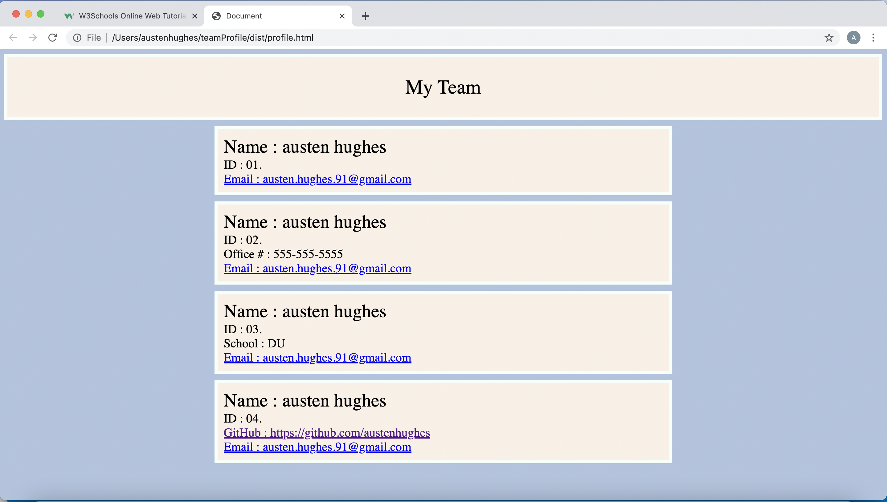

# TeamProfile Generator

Here you will find an application to quickly build html documents filled with individual info cards for each member of a team. 

## Installations :

you will need both :
- npm inquirer : https://www.npmjs.com/package/inquirer 
- npm jest : https://jestjs.io/docs/getting-started 

## Directions :

- open integrated terminal or navigate to the desired folder in your computer directory
- type node index.js
- a profile.html file will be created in the dist folder this will include the opening html
- you will then be asked to select a role 
- use the arrow keys to select a role and hit enter
- you will then be taken to fill out the questions for that role
- when done a card with the entered information will be added to the profile.html file
- from there you will be asked if you would like to enter another profile
- if you select yes : you will again be asked to select a role
- if you select no : closing html will be added to the profile.html page
- you will find the related css file in the dist folder as well
- take both of these and you will have a beautiful new html to share/use

## Sample/generated HTML profile :

## Video : 

https://drive.google.com/file/d/1ZhpEddjLSwtsvsJ2Ri5KOGC3610it17W/view?usp=sharing

## Github :

github repo : https://github.com/austenhughes/teamProfile

## Tests :

can all be found in the test folder in the github repo linked above

## Recourses :

w3schools : https://www.w3schools.com/
mozilla : https://developer.mozilla.org/en-US/
inquirer &
inquirer docs : https://www.npmjs.com/package/inquirer
jest &
jest docs : https://jestjs.io/docs/getting-started

## contact me at :
Email : austen.hughes.91@gmail.com
github : https://github.com/austenhughes